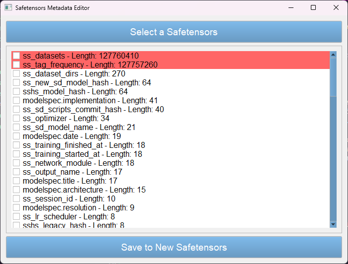

# trim_safetensors
Trim your metadata header of your safetensors

Safetensors as described in [huggingface safetensors page](https://huggingface.co/docs/safetensors/index) consists of a header and content.


[Huggingface safetensors library](https://github.com/huggingface/safetensors) is easy to use which can deal with safetensors files. But it has a limitation: the length of header cannot exceed 100M which can raise an error in their Rust code:

```Rust
/// The header is large than 100Mo which is considered too large (Might evolve in the future).
    HeaderTooLarge,
```

I am not sure why set 100M as the maximum length but it is not diffucult to write more than 100M header to a safetensors file using their library. Which, in my case, caused "HeaderTooLarge" error in my pytorch project.

You can not even modify the content of the metadata in the safetensors file because Rust will raise error in the very beginning it reads your file. So you can use my `trim_safetensors` python code to trim your metadata header.

It's easy to use. Just copy the `trim_sft_gui.py` and run
```shell
python trim_sft_gui.py
```

It will open a gui on your operating system (Windows/Mac/Ubuntu)




Select a safetensors file (you may need to wait a minute if the file is big)  and then tick the checkbox where the length is greater than 100M. All you need to do is to save to a new safetensors file and it's done.

> You may need to install `PyQt` manually via using `pip` if you do not have the library installed on your OS.

In case your system has no GUI, you can download `trim_sft.py` and follow the instructions from `python trim_sft.py --help` command